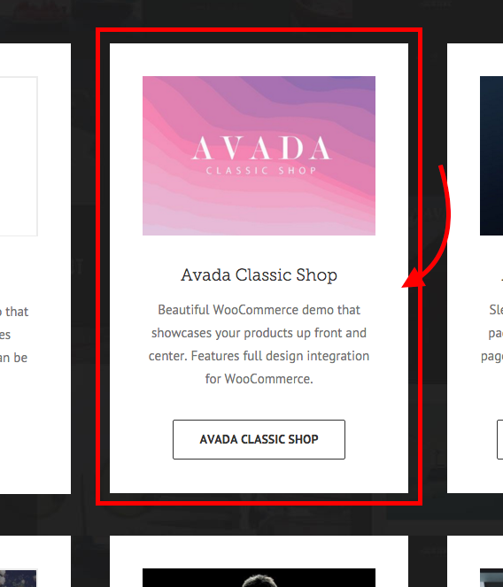
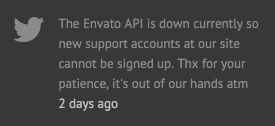
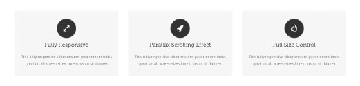
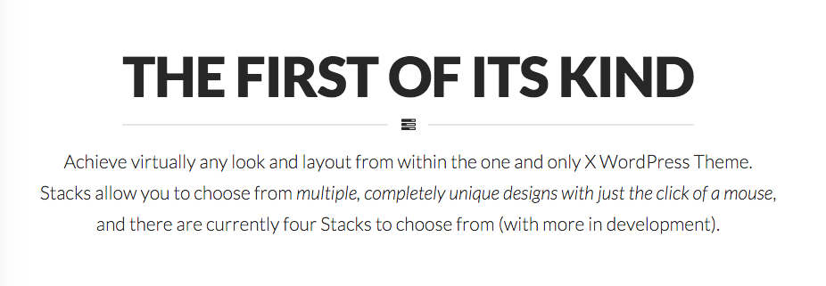
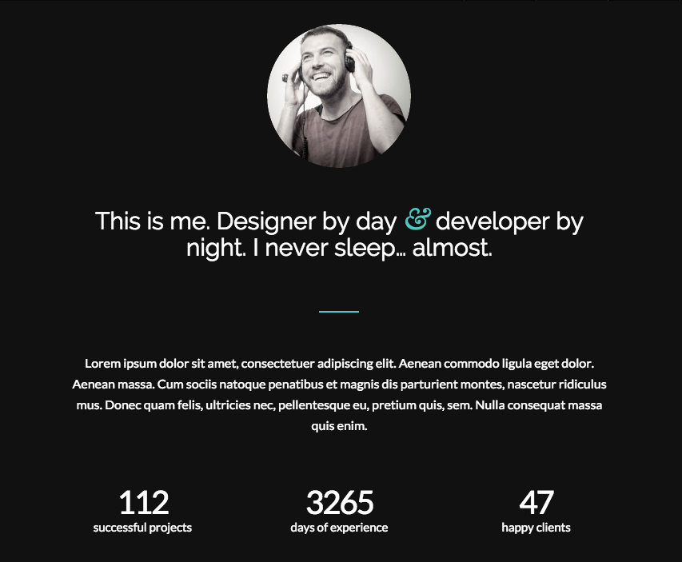
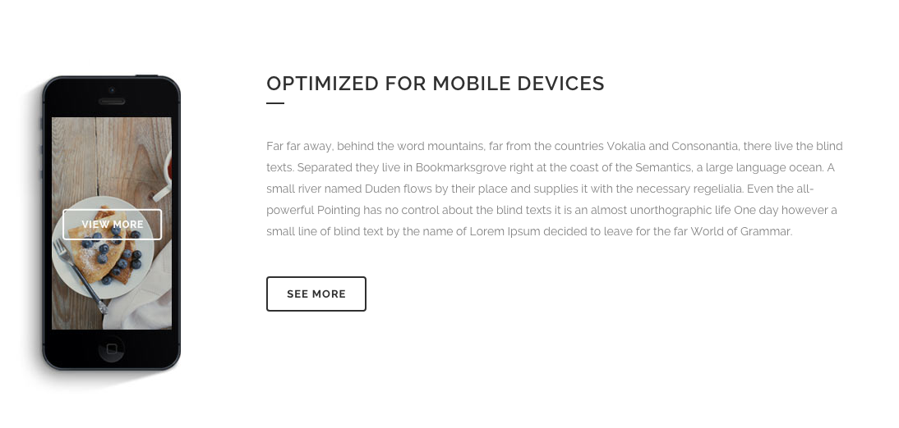
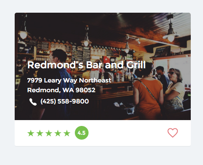
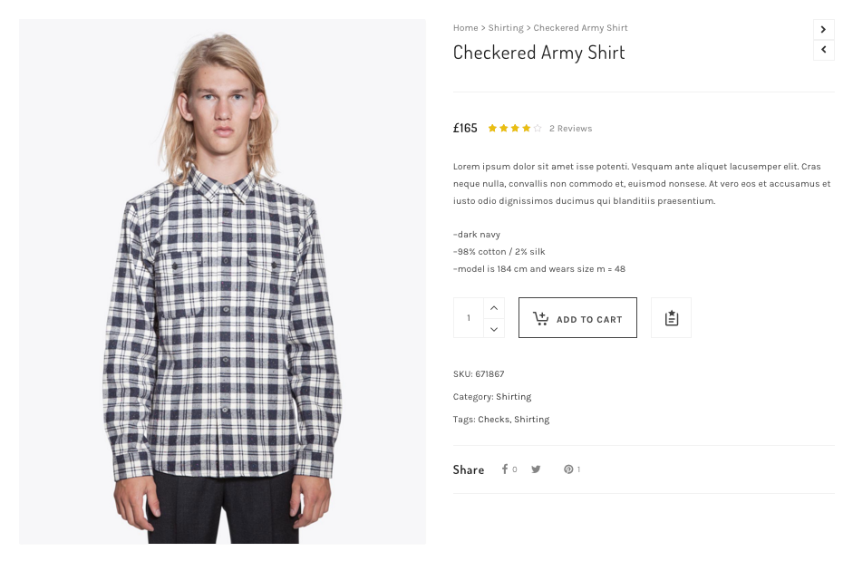

# Задание 1. Тренировка именования классов по БЭМ.

Я здесь накидал скриншотов разных часто встречающихся блоков, нужно будет написать плоскую структуру блока, о которой говорили в видео №2. [Примеры именования блоков и элементов](materials/bem-names.md).
Пример как оформлять привел для картинки №1. Все остальные нужно придумать самим. Всего их 11, если считать первую.

<figure>
    <figcaption>Pic 1</figcaption>
    <div></div>
 </figure>

```less
// Pic 1qwe
.info-block {
	&__img {}
	&__container {}
	&__title {}
	&__text {}
	&__btn {}
}
```
<hr> <br>

<figure>
    <figcaption>Pic 2</figcaption>
    <div></div>
 </figure>

```less
// Pic 2
.event-item {
  &__img {}
  &__wrapper {}
  &__text {}
  &__time {}
}
```
<hr> <br>

<figure>
    <figcaption>Pic 3</figcaption>
    <div></div>
 </figure>

```less
// Pic 3
.features-container {
  &__item-wrapper {}
  &__img {}
  &__title {}
  &__description {}
}
```
<hr> <br>

<figure>
    <figcaption>Pic 4</figcaption>
    <div></div>
 </figure>

```less
// Pic 4
.adv-block {
  &__title {}
  &__separator {}
  &__text {}
}
```
<hr> <br>

<figure>
    <figcaption>Pic 5</figcaption>
    <div></div>
 </figure>

```less
// Pic 5
.about-me {
  &__user-img {}
  &__about {}
  &__dash {}
  &__text {}
  &__stats-wrapper {}
  &__stats-item {}
  &__stats-num {}
  &__stats-legend {}
}
```
<hr> <br>

<figure>
    <figcaption>Pic 6</figcaption>
    <div></div>
 </figure>

```less
// Pic 6
.app-feature {
  &__img {}
  &__details-container {}
  &__title-wrapper {}
  &__title {}
  &__text {}
  &__btn {}
}
```
<hr> <br>

<figure>
    <figcaption>Pic 7</figcaption>
    <div></div>
 </figure>

```less
// Pic 7
.nav-bar {
  &__item {}
  &__cart {}
  &__num-in-cart {}
  &__search {}
  &__more {}
}
```
<hr> <br>

<figure>
    <figcaption>Pic 8</figcaption>
    <div></div>
 </figure>

```less
// Pic 8
.place-info {
  &__place-wrapper {}
  &__name {}
  &__address {}
  &__phone-wrapper {}
  &__phone-img {}
  &__phone-num {}
  &__rating-wrapper {}
  &__rating-start {}
  &__rating-score {}
  &__like-btn {}
}
```
<hr> <br>

<figure>
    <figcaption>Pic 9</figcaption>
    <div></div>
 </figure>

```less
// Pic 9
.subscription-plan {
  &__name {}
  &__separator {}
  &__price {}
  &__price span {}
  &__feature {}
  &__feature img {}
  &__get-started-btn {}
}
```
<hr> <br>

<figure>
    <figcaption>Pic 10</figcaption>
    <div></div>
 </figure>

```less
// Pic 10
.reviews-panel {
  &__title {}
  &__title-count {}
  &__list {}
  &__rate-col {}
  &__review-col {}
  &__rate {}
  &__name {}
  &__date-reviewed {}
  &__review-title {}
  &__review-text {}
}
```
<hr> <br>

<figure>
    <figcaption>Pic 11</figcaption>
    <div></div>
 </figure>

```less
// Pic 11
.product {
  &__img {}
  &__info {}
  &__header
  &__crumbs-product-name-wrapper {}
  &__crumbs {}
  &__product-name {}
  &__nav-buttons-wrapper {}
  &__nav-button {}
  &__dash {}
  &__price-rating-reviews-wrapper {}
  &__price {}
  &__rating {}
  &__reviews {}
  &__product-desc {}
  &__product-data {}
  &__product-data li {}
  &__social {}
  &__purchase-wrapper {}
  &__num-to-add {}
  &__add-to-cart-btn {}
  &__add-to-wish-list {}
}
```
<hr> <br>
